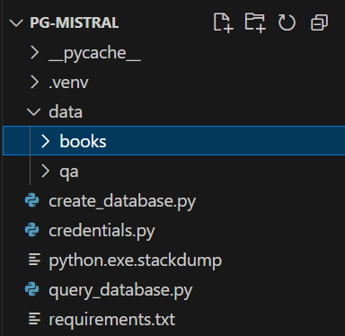

# Mistral-PG RAG

[Original tutorial from which this is modified](https://medium.com/@oanottage/0-poc-rag-application-1b12110caf88)

Utilizing the RAG technique, Mistral-PG will take your documents and answer your questions grounded in facts from those documents

## Models

[Mistral AI's mistral:7b](https://ollama.com/library/mistral)

[all-MiniLM-L6-v2](https://huggingface.co/sentence-transformers/all-MiniLM-L6-v2)

## Vector database

PostgreSQL's pgvector

## Setup

1. data

create folders data\qa

If you name your folder something other than qa, change the line 15 in the file create_database.py

Place your markdown files in the qa folder

2. create credentials.py file

3. Install Docker desktop and launch it

4. Install PostgreSQL 

5. Create virtual environment

> python -m venv .venv

6. Activate .venv

7. Within Visual Studio Code (VSC) terminal

> pip install -r requirements.txt

> pip install -U sentence-transformers

> pip install "unstructured[md]"

> pip install python-magic python-magic-bin

8. In command prompt or similar

> docker pull ankane/pgvector

> docker run --name mistral-pg -e POSTGRES_PASSWORD=password -p 5433:5432 ankane/pgvector> 

Replace above password with your PostgreSQL password

> docker exec -it mistral-pg psql -U postgres -d postgres

> CREATE DATABASE qa;

> \c qa

> CREATE EXTENSION vector;

Your folder should look more or less like this:

9. Create database

> python create_database.py

10. Ask questions

> python query_database.py "What is testing?"

If VSC cuts off words in the output, direct output to file 

> python query_database.py "What is testing?" > prompt1.txt

