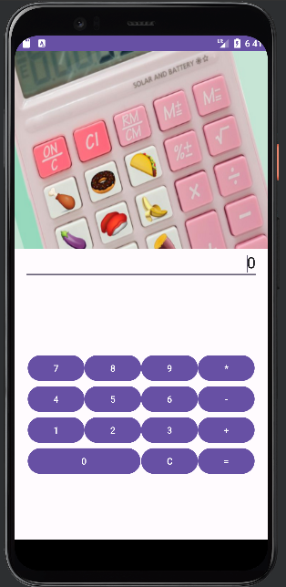
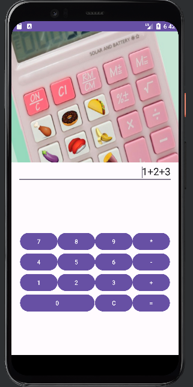
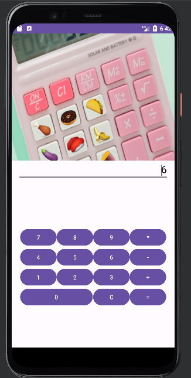
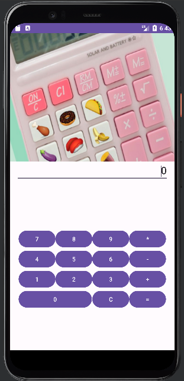
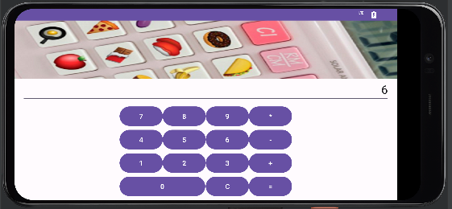

# Sum calculator

Sum works, C works and you can add any number of things together (not just num1 and num2)

Used Gridlayout.

## Portrait

Pressing C to clear things 

## Landscape

Pressing C to clear things 

