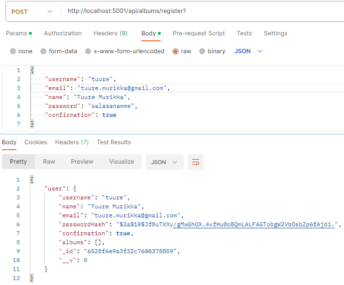
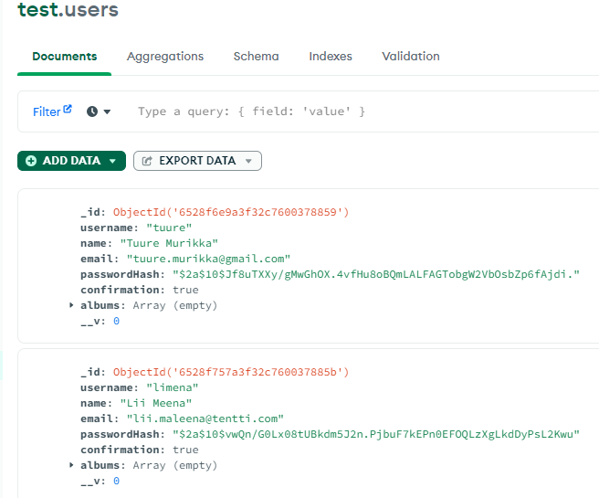
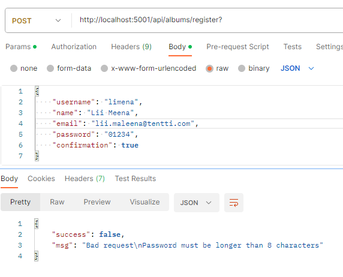
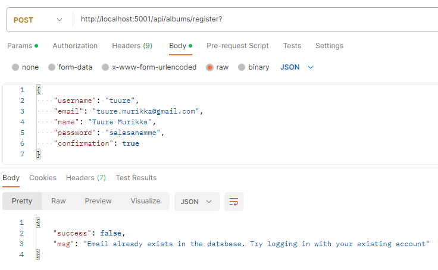
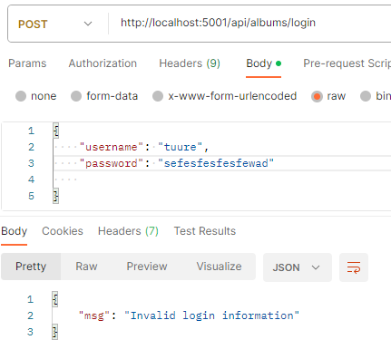

# Node Backend Server

- Using MongoDB to contain the data
- passwords are hashed
- the posted additions are visible on MongoDB Compass
- receiving an auth token in response to a successful login

## Adding a user: a successful example

View from Postman

## View on MongoDB Compass

## For comparison, an unsuccessful attempt because of the validators

## Re-adding a user: this is supposed to fail, as it does

## Album deletion

Before deletion

After deletion

# Login 

Fail

Success

