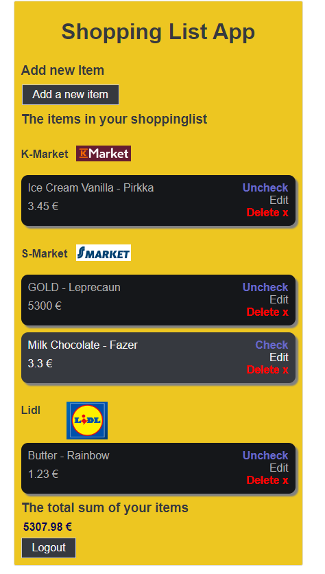
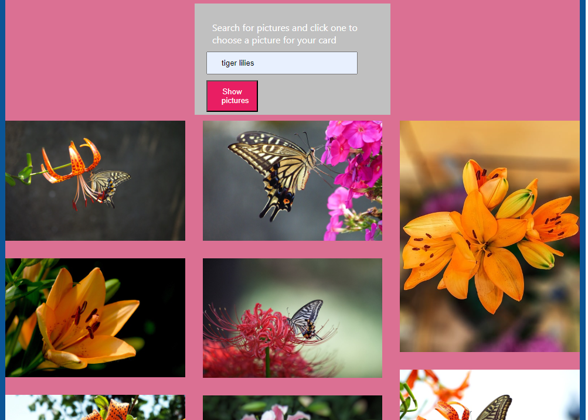

# What I learned from my projects

## React

### shopping-list app

A shopping list app where you can view, add, edit, and delete shopping list items (CRUD), and also check and uncheck them.

Build requires log in

[Source code](https://github.com/vihervirveli/portfolio/tree/master/Typescript/shoppinglist-app)

### pic-app

A picture app where you can create a card and search for pictures using Pixabay API

[Link to the build](https://student.labranet.jamk.fi/~p0033/harkka/)

[Source code](https://github.com/vihervirveli/pic-app)

