# Shopping List App

Plan: Shopping List app

- X different users (different views with different users) Firebase + React router
- X adding an item (Firebase)
- X removing an item (Firebase)
- X editing an item (Firebase)
- X checking/unchecking an item (Firebase)
- X a single item has the information on 1) item 2) which store it's 
from 3) price 4) username (edit: this list grew)
- X total price from all the items in one list

## 6.3.2023

14.45-16.20

Creating the app. Initially made it under course repository, so I had to spend time making a new one.

Component ideation:

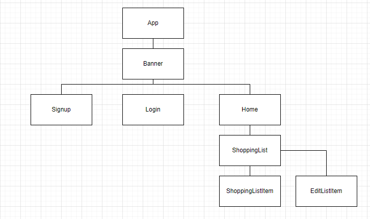

The teacher said it's confusing because of the banner, so I'll table that for now.

So far I got the Firebase end working. So far it doesn't check the user based items, but that's for later. The React-Router works too.

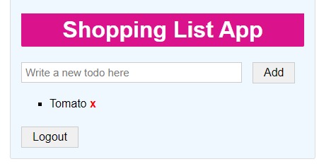

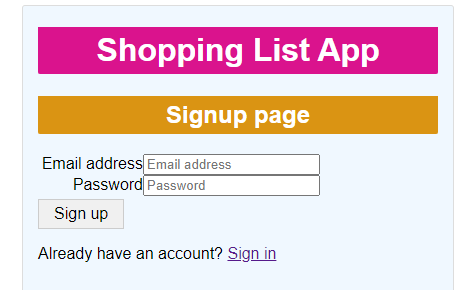

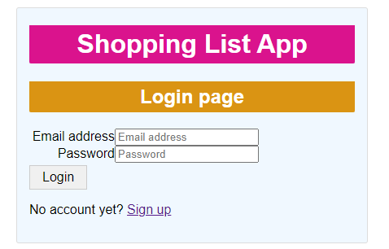

In total, 1h and 35 minutes of work.

## 8.3.2023

40 minutes spent on trying to find out if there was a more intelligent way to 

connect data and the users on Firebase. I think I'm going to go with the original plan.

15 minutes getting the new add form started, but headache struck so I'll continue later.

In total, 2h 30 min of work.

## 10.3.2023

10.20-13.00  = 2h 40 minutes

Lunch break

14.45-17.05 = 15min + 2h + 5minutes = 2h 20min

Today, altogether 2h 20 + 2h 40 = 5 hours

I got the new AddForm to work, and added a new item with it.

So currently the functionality is that I can log in, and see my items, as well as

add a new item. I also added a new user beforehand. So I'm doing quite well.

The items currently have the following attributes: 

1) title
2) brand
3) checked
4) store
5) price
6) email
7) user

I decided to do this in Typescript React after all, so this might be difficult.

I installed Typescript to my existing project. I struggled with the switch, since 

some files had to be called .tsx even though they were just .js in the original project,

and if they were merely called .ts, it caused a lot of weird errors. Currently I'm

at a point where I am actually trying to fix the project to work with Typescript.

Some of this is pretty desperate, I had 46 errors at some point, fixed some,

got more in return, and sometimes fixing one meant invoking another.

It took I'm afraid to look how many hours, but I finally fixed the errors enough for it to compile.

It required me to mark user and email as string | undefined, which might be considered a bad move, but 

I'll fix that later. Possibly.

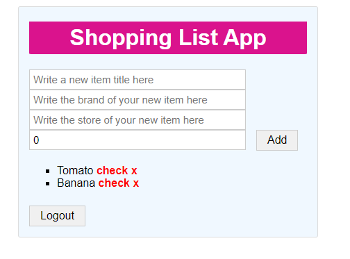

In total, 7h 30 minutes have gone into this project.

## 13.3.2023

10.20-11.30 = 40+30 = 1h 10 min

Lunch break

13.30-15.35 = 30min + 1h + 35 min = 2h 5min

Altogether = 3h 15 min

To begin with, I'll be trying to fix "Warning: Each child in a list should 

have a unique 'key' prop." error.

Apparently the problem is that Firebase doesn't create an id for the item automatically

if I add new items to the database through my application.

Okay, I checked and apparently the docref thing IS the id. I just havent been utilizing it properly.

I called the teacher and talked about the issues, and now I managed to put one item into the database

through the application. Still having problems with the input thing.

Okay, now the input thing works, and currently in my application,

one can 

1) create a new user
2) log in
3) see one's own shopping list items
4) add a new item
5) delete an item
6) The total price of the shopping list is visible to the user

This is almost everything that I promised to do initially, with the exception of 

7) editing an item
8) Checking/Unchecking an item (with styling and react icons)

also still to do:

9) turn input fields into dropdown fields for brand and store
10) Get rid of undefined/null options
10) Style things better

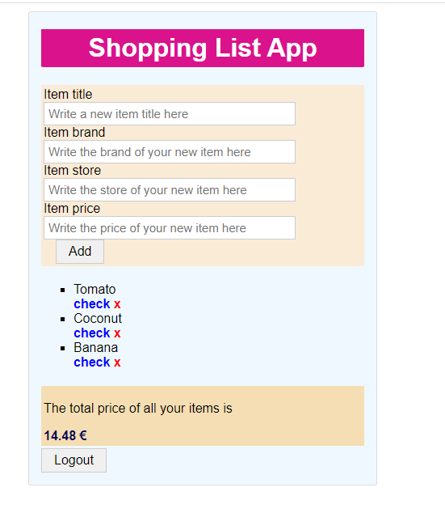

So far 10h 45min have gone into this project.

## 17.3.2023

11.00-13.20 2hours and 20 minutes

14.55-15.05 10 minutes

Altogether 2 hours and 30 minutes

Trying to implement the check/uncheck functionality.

I created a separate component called ListItemDefault and transferred the necessary elements there.

This way I can give the elements a check/uncheck property, since I can ask if the item has the check property

as true or false, and then add the span element accordingly.

Currently when I add a new item on the list, the checked attribute shows up looking different than the other ones.

Ah, teacher helped me find that I had forgotten to edit one line and that was why the new check looked different.

Now it works.

The check toggle is still unimplemented, it will need to reach the database in order to be affective.

Altogether 13 hours and 5 minutes have gone into this project.

## 22.3.2023

10.25-11.25 so 1 hour in total.

I made the scaffolding for EditItem and worked on how to update the check functionality. 

The check thing works now, but it doesn't show up until I refresh.

Okay, now I can check and uncheck items on my shopping list, and it shows up on screen immediately.

I discovered there's a way to set a document (completely rewrite it) and update a document (partially 

rewrite it) which will come in handy next, when I need to update an entire item, but possibly only a 

field or two. 

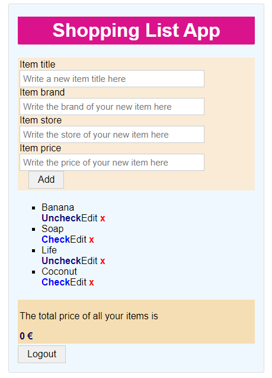

Altogether 14 hours and 5 minutes have gone into this project.

## 28.3.2023

9.20-12.15 so altogether 2 hours and 55 minutes. 

17.25-18.15 so altogether 50 minutes.

So I'm trying to make it so that when I click edit on an item, it will show me a component that has that 

item's information on it, and then disappear.

Although first I'm trying to fix the fact that totalPrice is disappearing and saying it's zero.

I fixed it, then it blew up again, and I fixed it again.

I decided to do the edit thing directly to each component, so inside the component itself.

I edited the styles, so far it looks like this.

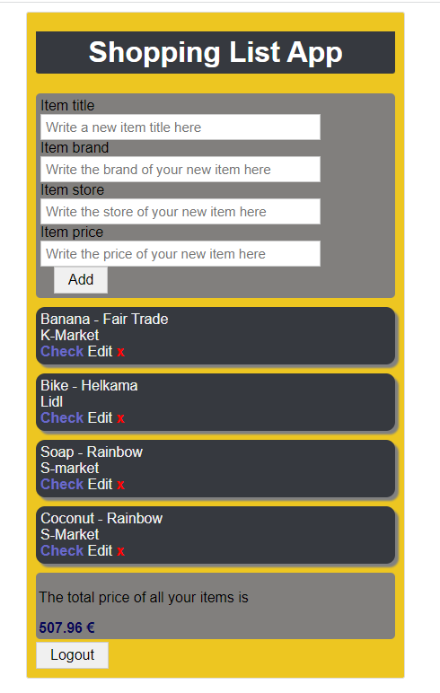

I edited some more, and I think it's starting to look really nice.

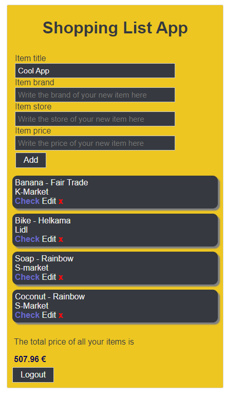

I think I'm using the styling to avoid implementing the edit function, but 

I edited the styles some more, and it's even better now.

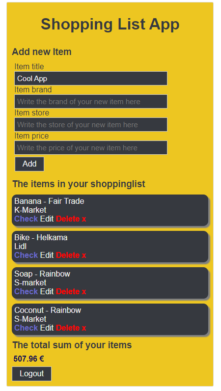

I have another class now, so I have to go, but I'll continue later.

I should make the item information show up on the left, and the functionalities 

(edit, save, uncheck/check) on the right. So at least two levels of grid layout.

Altogether 17 hours have gone into the project.

Came back later to work on the edit portion of the ListItemDefault.

Now I can turn any item into a changeable form for editing.

The actual editing function isn't done yet, but it's looking promising.

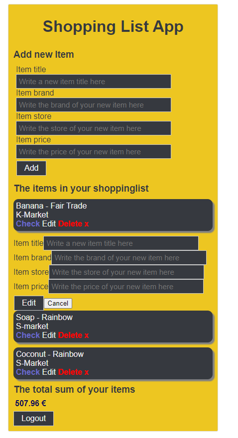

And now the item's previous information is showing up in the fields.

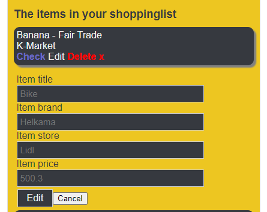

And the buttons are now styled.

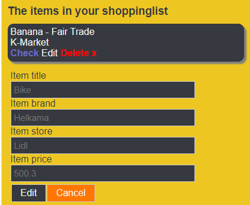

The editing portion will wait for another day.

Altogether 17 hours and 50 minutes have gone into this project.

## 30.3.2023

9.50-11.25 so 1h and 35 minutes   

I edited the layout some more, and now I'm working on the editing part again.

This is starting to be very complicated, and I need to pass at least 10 props to each child component, 

so redux toolkit is starting to look tempting.

With the new functions, the addForm only shows up if the user presses a button.

Next time I'll try to make the editing and add modes be opposites, so if you're editing, you're not 

adding, and so on.

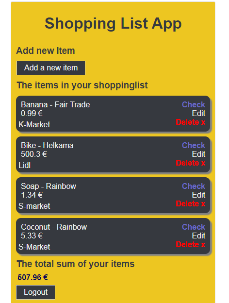

The new layout is like this for the items.

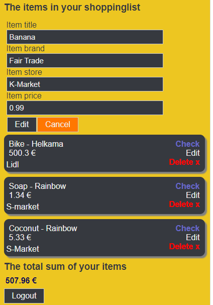

Altogether 19 hours and 25 minutes have gone into the project.

## 31.3.2023

10.20-12.15 before lunch hour, 1 hour and 55 minutes.

Created new states for editing information so the same info won't show up in both

the addForm and the editing form.

Alright. Now I can toggle between showing the addForm and not showing it.

Next up is finally actually doing the editing portion.

I'm having trouble getting how to know when to edit 1, 2, 3 or 4 informations.

I'm going to ask the teacher if he has any ideas.

The teacher suggested using setDoc instead of update, so just 

overwriting the object every time I update it. I'll think about it.

Altogether 21 hours and 20 minutes have gone into the project.

## 2.4.2023

9.40-10.00

Firestore test mode is expiring for my items-collection, so I needed to make a new rule that

only authenticated users can see the data, and just in case that rule somehow isn't enough,

I made a new database and copied 2 items there for backup. If all else fails, I'll use that.

Altogether 21 hours and 40 minutes have gone into the project.

## 3.4.2023

10.40-12.10 So far I've worked on this for 1 hour and 30 minutes.

Handling setDoc as well as transferring states from parent to children to avoid unnecessary

state changes. Everything is a mess at the moment.

Well, it took a while, but now I can edit the items. I am using setDoc just so I don't have to

make like 24 different calls to the database. (The permutations for 4 different possible choices).

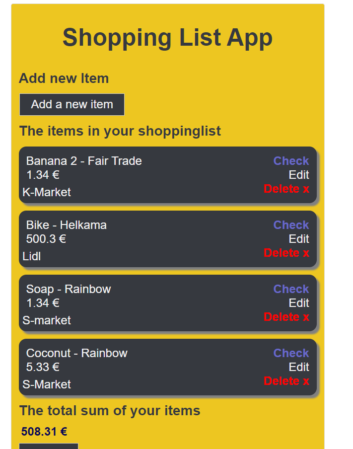

Technically this is ready now. But I thought I'd also make 3 different lists, one for each store, so the 

user can know which items to get from which store. I'll return to this later.

Altogether 23 hours and 10 minutes have gone into the project.

## 4.4.2023

9.30-11.05 so 1 hour and 35 minutes today.

I called the teacher and he agrees that this is basically done now. Some fine tuning is required but then I can finish and present it.

The items are now sorted per store. I'm going to add pictures to the stores so they are distinguished 

from each other better. 

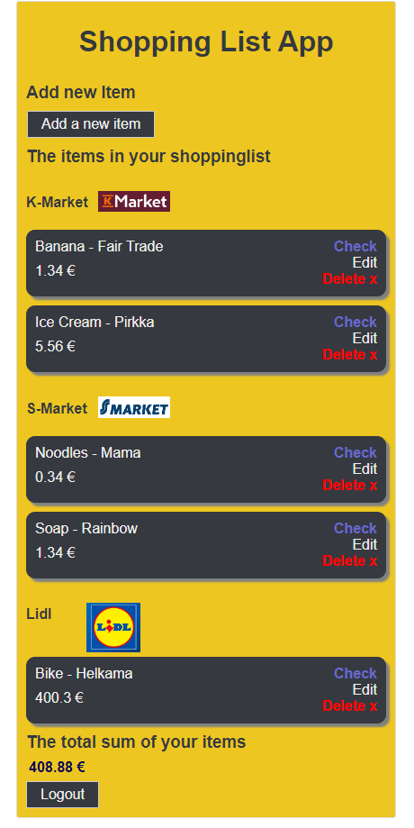

It's looking very nice. Still need to switch the store and possibly brand distinguishers into dropdown

menus. Although the brand would probably be a problem since I can't get all the brands into it, so I'll

just use the store dropdown menu.

Altogether 24 hours and 45 minutes have gone into the project.

## 5.4.2023

14.10-15.50 so 1 hour and 40 minutes. 

I just need to add the store dropdown menus and possibly the checkmarks.

And test whether this works for several users.

Okay, I tested it, and the information for the other user also show up for another user. 

So I need to fix that. First I'll do the dropdown because hopefully that will take less

time.

The dropdown now works for the AddForm. Then just need to add it to the editing portion.

Okay, now the editing dropdown works too. Now if I can just fix the user info and CSS the dropdowns

a bit, this should be done.

I'll do the CSS first because it will be faster.

Okay the dropdowns are styled now, the only thing remaining is fixing the items array to only contain 

the current user's items.

Okay, it's done, I think. For a moment there I thought everything broke, but now it looks 

normal, and the users only see their own items.

Altogether 26 hours and 25 minutes have gone into the project, and I'm almost ready to present this.

## 6.4.2023

9.50-12.55 so 3 hours and 5 minutes until lunch break. 29 minutes and 30 minutes have gone into the 

project so far before lunch break.

15.05-15.40 so 35 minutes recording the video for the presentation. 

Okay there's still a tiny problem that when I login, there are no items until I refresh.

If I can fix that, then this is truly done and then I can present this.

I think I fixed it, or at least close enough that it works pretty well now.

I had some trouble with the build until the teacher's video reminded me that I need

to set basename to the router. Now the build is running at my website:

https://student.labranet.jamk.fi/~p0033/wuipharkka/pg/

Working on the presentation.

The presentation is pretty ready to be videod, but for now, lunch break.

I recorded the video and did the last touches.

Altogether 30 hours and 5 minutes went into the project.